# Lab1.

# 1번 문제

Block diagram

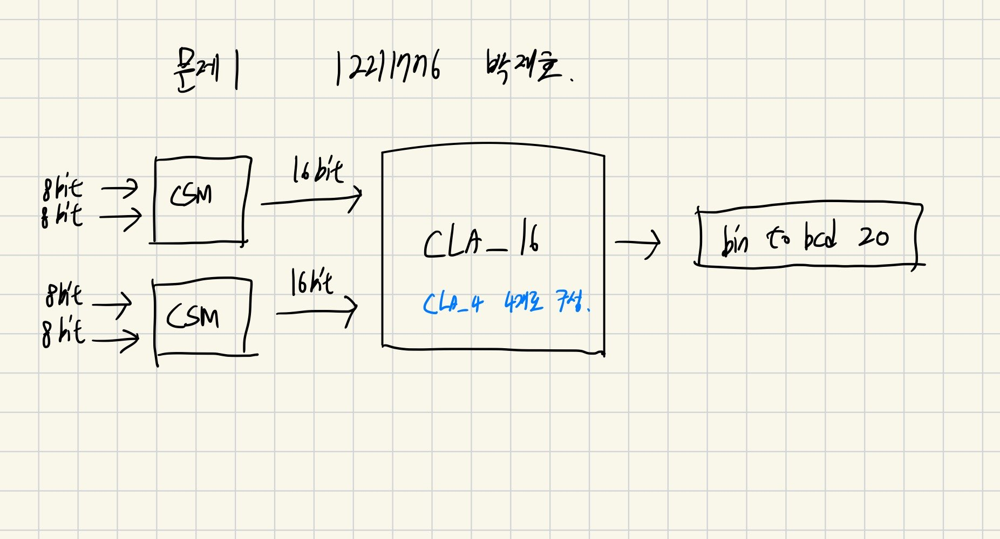

[작성한 블록 다이어그램]

Verilog  Code /  주석

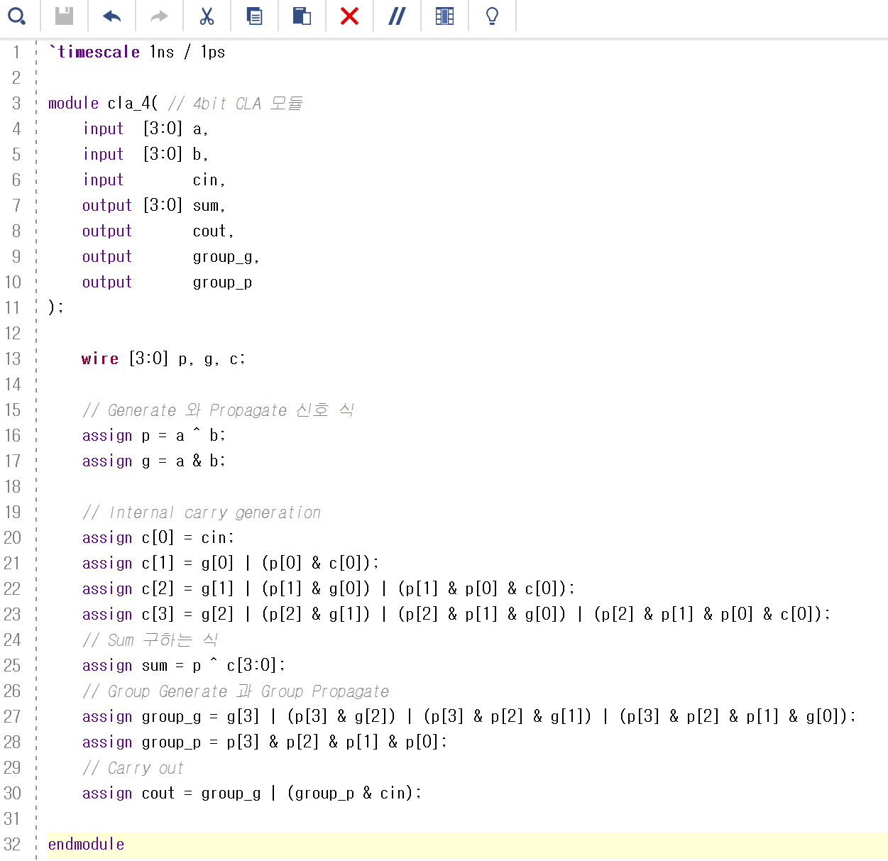

[CLA_4 module]

이 모듈은 4비트 캐리 룩어헤드 가산기(CLA: Carry Lookahead Adder)를 구현한 Verilog 코드이다. 두 개의 4비트 입력값과 1비트 입력 캐리를 받아 4비트의 합과 최종 출력 캐리를 계산한다. 또한 그룹 생성(Group Generate)과 그룹 전파(Group Propagate) 신호를 출력하여, 상위 16비트 CLA 블록과의 연동을 가능하게 한다.

입력으로는 두 개의 4비트 벡터 a와 b, 그리고 1비트 입력 캐리 cin이 있다. 출력은 계산된 합 sum (4비트), 출력 캐리 cout (1비트), 그리고 그룹 생성 신호 group_g, 그룹 전파 신호 group_p로 구성된다.

다음으로 입력 a와 b의 각 비트를 이용하여 비트 단위 Propagate 신호는 XOR 연산으로, Generate 신호는 AND 연산으로 구해진다. Propagate는 캐리가 전파될 수 있음을 의미하며, Generate는 해당 비트에서 캐리가 직접 생성됨을 의미한다.

입력 캐리 cin을 시작으로, 각 자리수의 캐리는 바로 다음 비트의 계산에 영향을 미친다. 이를 위해 리플 캐리 방식이 아닌, 병렬적으로 carry를 예측하는 룩어헤드 방식이 사용된다. 각 비트의 캐리는 이전의 Generate 및 Propagate 신호들을 논리적으로 결합하여 미리 계산된다. 이렇게 하면 덧셈 연산의 속도를 향상시킬 수 있다.

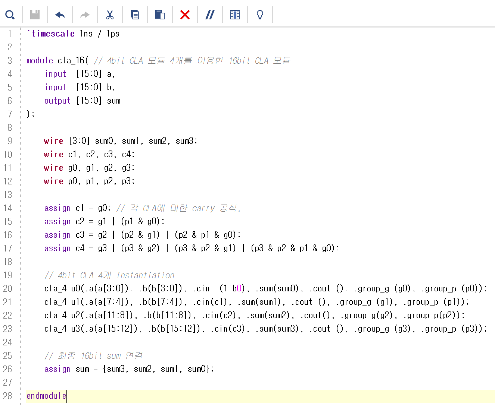

[CLA_16 module]

cla_16은 4비트 CLA 모듈(cla_4)을 네 개 연결하여 16비트 덧셈기를 구성한 구조이다. 입력은 두 개의 16비트 벡터이며, 출력은 덧셈 결과인 16비트 벡터 sum이다. 각 4비트 블록 간의 캐리 연산은 그룹 생성(Group Generate)과 그룹 전파(Group Propagate) 신호를 기반으로 계산된다.

먼저, c1~c4는 하위 CLA 블록의 g와 p 값을 조합하여 계산된다.
예를 들어 c2는 두 번째 CLA 블록의 입력 캐리이며, 이는 첫 번째 CLA 블록이 캐리를 생성했거나, propagate 경로를 통해 cin=0으로부터 전파된 경우이다. 이러한 방식으로 다음 블록에 대한 입력 캐리를 순차적으로 미리 계산한다.

그리고 각 4비트 sum을 하나의 16비트 sum으로 병합하여 출력한다. 순서는 최상위 블록인 sum3가 가장 왼쪽 비트(상위 비트), 최하위 블록인 sum0이 가장 오른쪽 비트(하위 비트)이다.

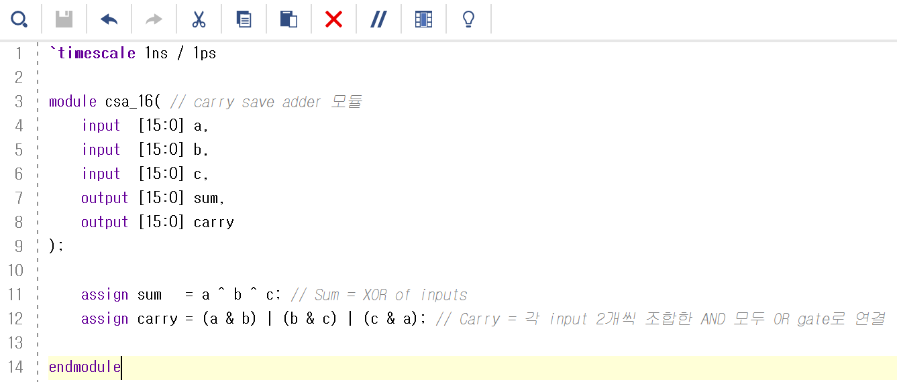

[csa_16 module]

이  모듈은 3개의 16비트 벡터를 입력받아 Carry-Save 방식으로 합과 캐리를 계산하는 회로이다. 이 구조는 곱셈기나 다수의 덧셈 연산이 필요한 경우, 빠르게 중간 결과를 계산할 수 있는 효율적인 방법으로 사용된다.

입력 포트는 16비트 벡터 a, b, c로 총 3개의 피연산자를 입력받는다. 출력 포트는 두 개로, sum은 자리수별 임시 합을 나타내며, carry는 자리수 간에 발생한 캐리 비트를 나타낸다. 이 두 결과는 이후 Carry-Propagate Adder를 통해 최종 합으로 합쳐질 수 있다.

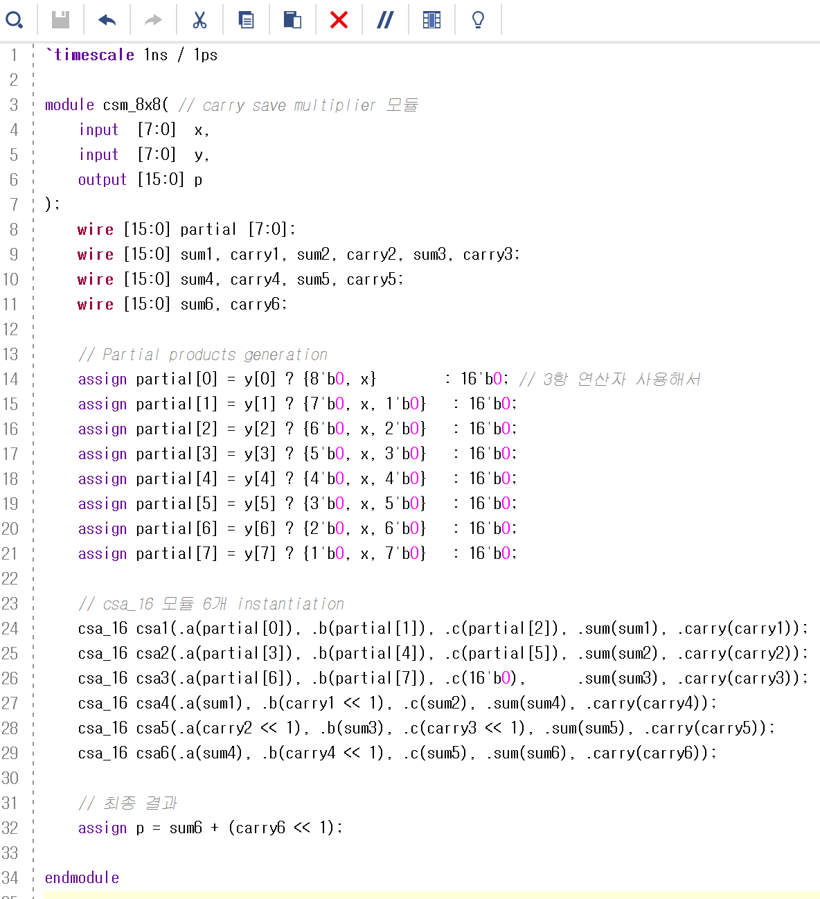

[csm module]

모듈 csm_8x8은 8비트 곱셈 연산을 Carry Save 방식으로 구현한 곱셈기이다. 입력으로는 8비트 피연산자 x, y를 받고, 출력으로는 16비트 곱셈 결과 p를 반환한다. 이 구조는 빠른 병렬 연산이 가능하여 곱셈기의 성능을 높이는 데 유리하다.

먼저, 8개의 partial product를 생성한다. y의 각 비트를 기준으로 x와 AND 연산을 수행하고, 그 결과를 해당 위치만큼 비트 시프트하여 16비트로 확장한다. 예를 들어, y[0]이 1이면 partial[0]은 x, 아니면 0이고, y[1]일 경우 x를 한 비트 왼쪽으로 시프트해서 partial[1]로 설정하는 식이다.

총 6개의 csa_16 모듈을 사용하여 partial product를 순차적으로 더한다. 각 단계에서는 3개의 16비트 벡터를 입력으로 받아 임시 합(sum)과 캐리(carry)를 출력한다.

마지막 단계에서 CSA의 결과 sum과 carry를 한 번 더 더하여 최종 결과를 계산한다. 이때 carry는 다시 1비트 왼쪽으로 shift되어 자리 올림을 반영한다.

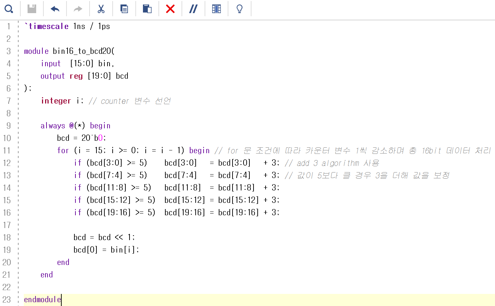

[bin to bcd module]

모듈 bin16_to_bcd20은 16비트 이진수를 입력으로 받아 5자리 BCD (Binary-Coded Decimal) 값으로 변환하는 기능을 수행한다. 변환 알고리즘으로는 Shift-and-Add-3 알고리즘을 사용하여, BCD 형식으로 값을 표현할 수 있도록 한다.

먼저, always 블록 내에서 bcd는 처음에 20'b0으로 초기화된다. 그리고 16비트 입력을 처리하기 위해 for문이 15부터 0까지 총 16회 반복된다.

그리고 BCD의 각 4비트 블록(자릿수)에 대해 값이 5 이상일 경우, 3을 더해준다. 이는 Shift-and-Add-3 알고리즘의 핵심으로, 올바른 BCD 표현을 보장하기 위해 수행된다. 각 조건문은 자릿수가 5 이상인지를 판단하여 BCD 오류를 방지한다.

BCD 전체를 왼쪽으로 1비트 시프트하여 상위 비트로 값을 올린다. 이는 새로운 이진수를 삽입할 공간을 마련하는 과정이다. 마지막으로, 입력 이진수의 현재 비트 bin[i]를 BCD의 최하위 비트 bcd[0]에 삽입한다. 이로써 순차적으로 이진수 데이터를 BCD 형식으로 변환해간다.

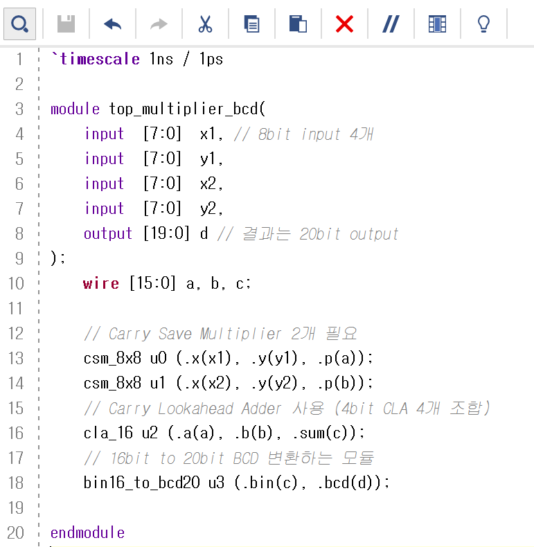

[top module]

이 모듈은 전체 시스템의 최상위 모듈로, 두 개의 8비트 곱셈을 수행하고, 그 결과를 더한 뒤 BCD(Binary-Coded Decimal)로 변환하여 최종 출력을 생성한다. 전체 연산 흐름은 Carry Save Multiplier - CLA 덧셈기 - BCD 변환기 순으로 이루어진다.

곱셈 결과 a와 b를 16비트 Carry Lookahead Adder(cla_16)를 이용해 더한다. CLA는 내부적으로 4비트 CLA를 4개 사용하여 빠른 캐리 계산을 통해 전체 덧셈 연산의 속도를 향상시킨다.
연산 결과는 c에 저장된다.

덧셈 결과 c는 bin16_to_bcd20 모듈을 통해 BCD 형식으로 변환된다. 이 모듈은 Shift-and-Add-3 알고리즘을 기반으로, 이진수 16비트를 5자리 십진수로 변환하며, 변환 결과는 최종 출력 d로 전달된다.

Synthesis Report

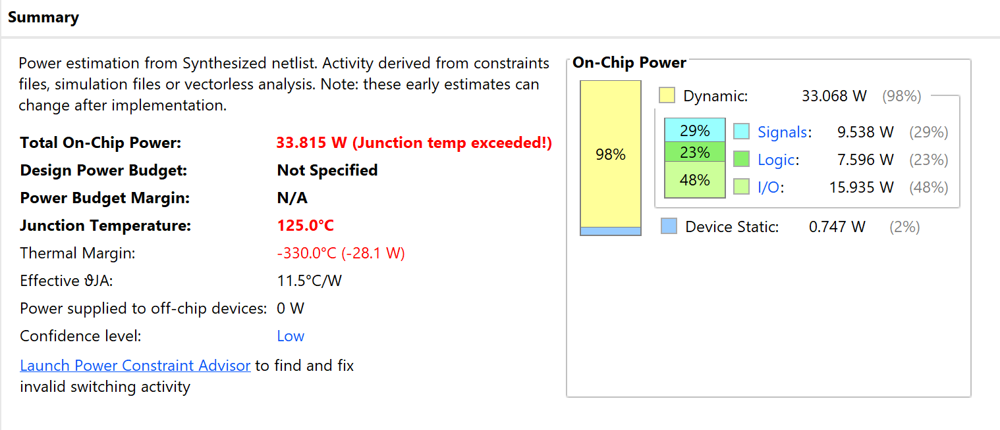

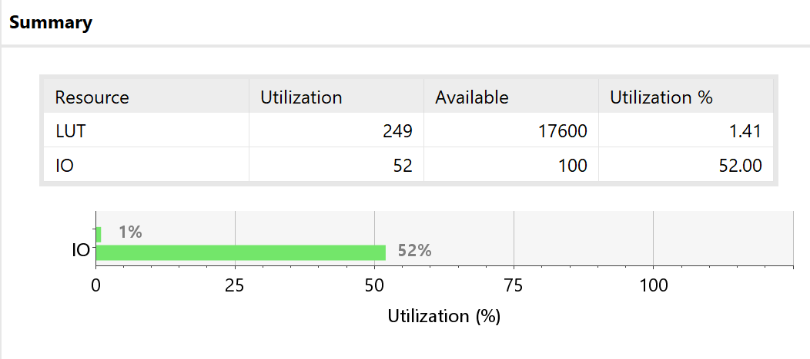

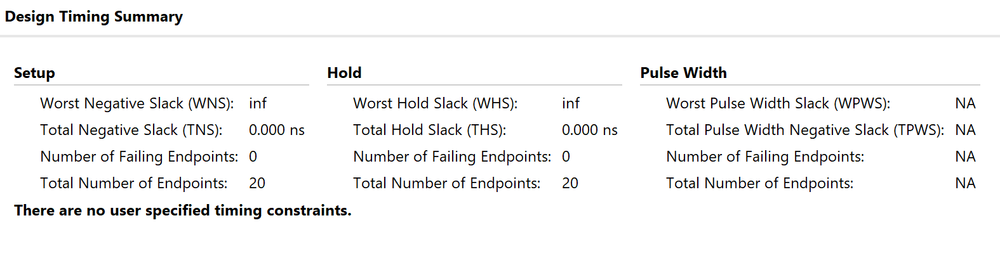

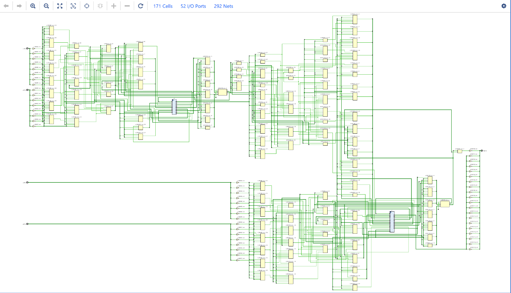

Test Bench Code

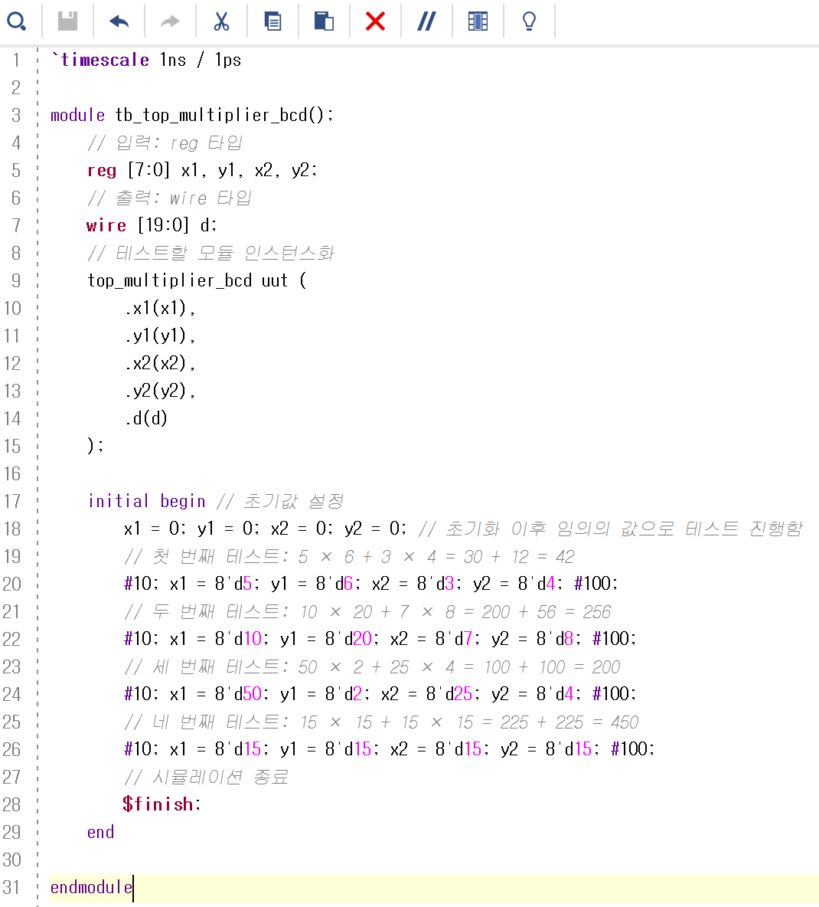

[testbench code]

테스트벤치 모듈 tb_top_multiplier_bcd는 최상위 모듈 top_multiplier_bcd의 기능을 검증하기 위해 설계되었다. 총 4개의 8비트 입력값을 설정하고, 이에 대한 연산 결과를 20비트 BCD 형식으로 출력하는지를 확인하는 것이 목적이다. 주요 연산은 두 개의 8비트 곱셈과 CLA 덧셈, 그리고 BCD 변환으로 구성되어 있다.

먼저, 입력값으로 사용될 x1, y1, x2, y2는 reg [7:0] 타입으로 선언되어 시뮬레이션 시 값을 임의로 변경할 수 있게 설계되었다. 출력값인 d는 wire [19:0] 타입으로 선언되어, 실제 회로 동작 결과가 이 신호로 연결되어 관찰된다.

각 테스트 케이스에 대해 처음에는 모든 입력값을 0으로 초기화한다.  각 테스트마다 약간의 대기 시간(10ns)을 주고, 곱셈 결과를 BCD로 출력하는지를 검증한다. 시뮬레이션 결과를 확인하여 이를 확인하였다.

Simulation Result

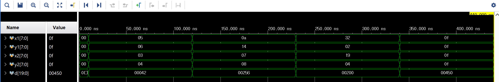

[behavioral simulation result]

시뮬레이션 파형을 분석해 보면, 결과값이 42, 256, 200, 450으로 모든 테스트 케이스에서 입력값에 따른 곱셈, 덧셈 결과가 정확하게 연산되었으며, 최종 출력 d는 20비트 BCD로 정확히 변환되어 출력되었다. 시간 지연 없이, 각 입력 변화 직후 일정한 시간 간격 후에 정해진 출력이 안정적으로 나타난 점에서 회로의 타이밍 및 동작 흐름 또한 정상임을 확인할 수 있다.

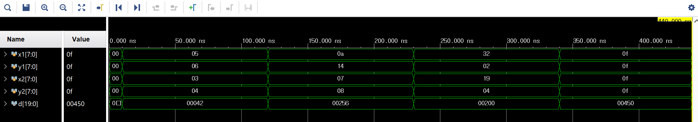

[post synthesis functional simulation result]

[post synthesis timing simulation result]

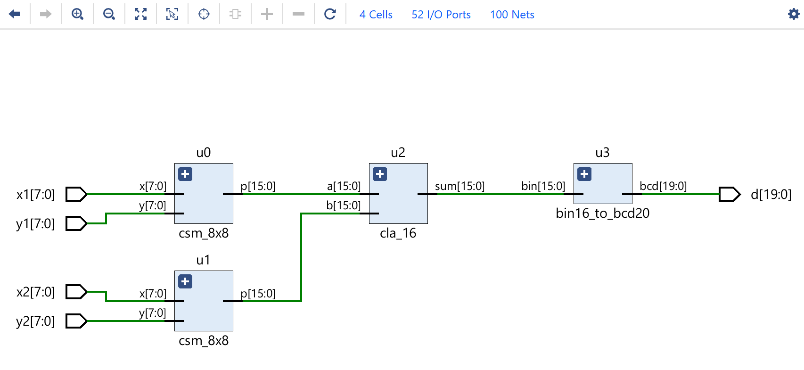

[elaborated design schematic]

고찰

이번 설계는 두 개의 8비트 곱셈 결과를 더한 후 BCD 형식으로 출력하는 구조로, 곱셈기, CLA 가산기, BCD 변환기로 구성되었다. Carry Save Multiplier를 사용해 곱셈 속도를 높였고, CLA를 통해 빠른 덧셈을 수행하였다. 최종적으로 BCD 변환기를 통해 사람이 읽기 쉬운 형태로 출력되도록 하여, 전체 연산의 정확성과 효율성을 모두 확보할 수 있었다고 생각한다. 또한, 병렬 연산 구조의 중요성과 모듈 간 연계의 효과를 확인할 수 있었던 과제였다.

# 2번 문제

Block diagram

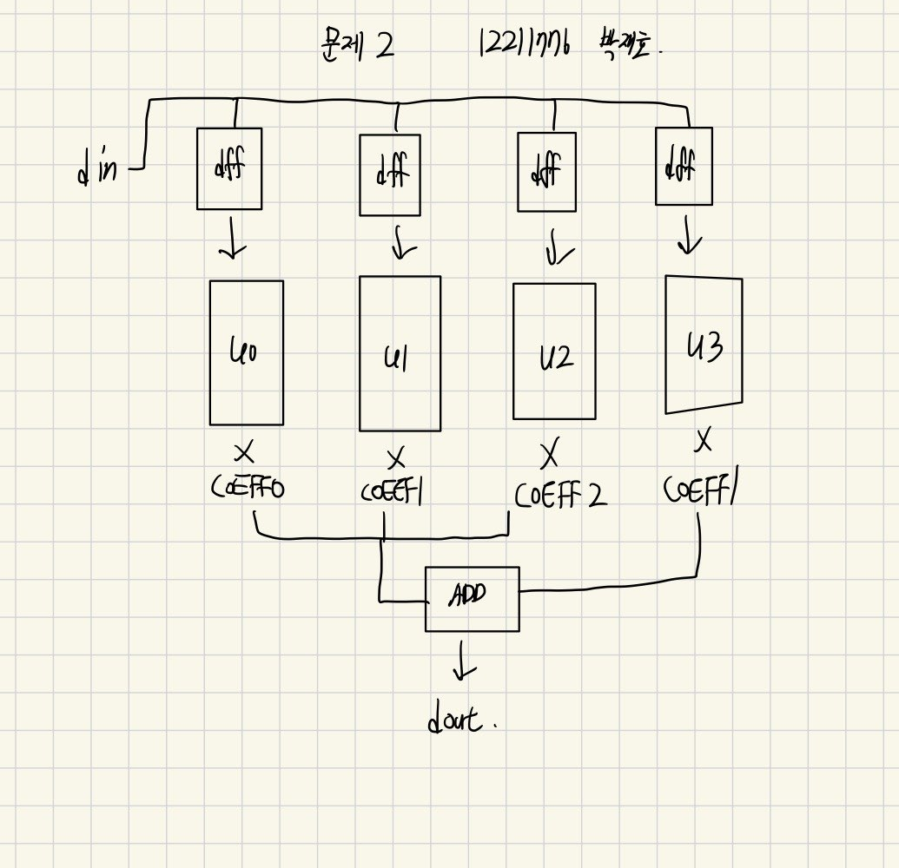

[작성한 블록 다이어그램]

Verilog  Code /  주석

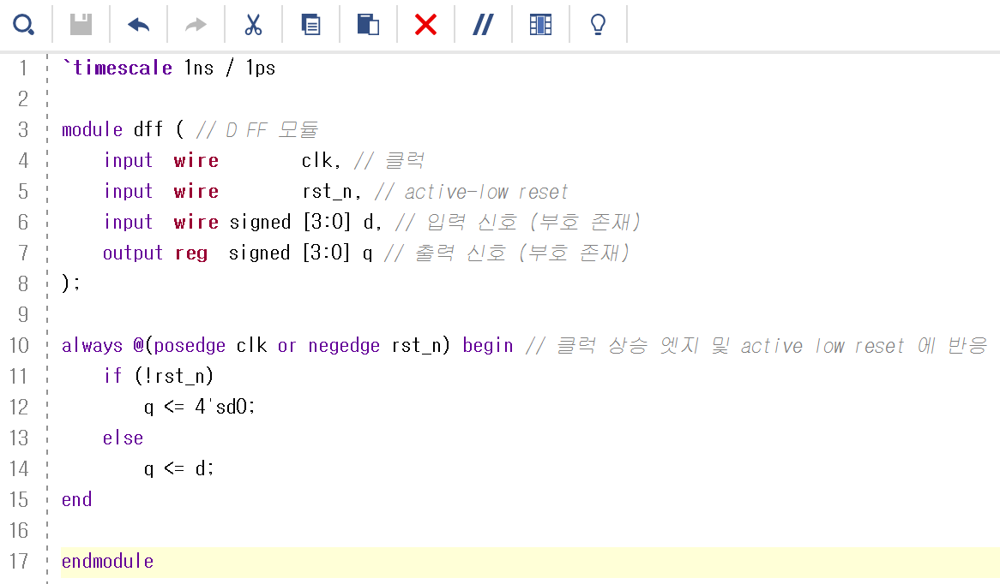

[dff module]

이 모듈은 4비트 부호 있는 입력을 저장하는 동기식 D 플립플롭(D Flip-Flop) 회로이다. 클록 상승 에지(posedge clk) 또는 비동기 리셋(negedge rst_n)에 반응하여 출력 값을 갱신하거나 초기화하도록 설계하였다.  Clk는 클록 신호이며 상승 엣지에서 데이터가 저장된다. rst_n는 비동기 리셋(active-low)으로 0이 되면 출력이 즉시 초기화된다.

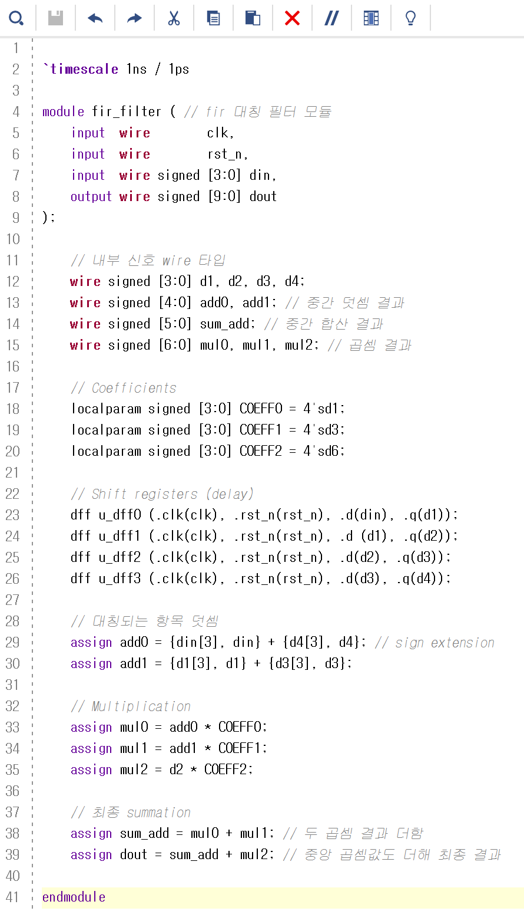

[fir module]

fir_filter 모듈은 FIR(Finite Impulse Response) 구조를 구현한 회로이다. 입력 신호를 시간 지연시킨 뒤, 각 지연된 값에 고정 계수를 곱하고 이들을 합산하여 필터링된 출력을 생성한다. 이 설계는 3탭 FIR 구조이며, 정수 기반 연산을 바탕으로 하드웨어에서 효율적으로 구현되었다.

먼저, 입력 din은 d1, d2, d3, d4로 순차적으로 지연된다. 이를 위해 4개의 D 플립플롭 모듈(dff)이 사용되며, 입력 데이터를 클럭을 따라 한 단계씩 밀어주는 역할을 한다. 이 구조를 통해 시간 축 상에서 과거 입력 샘플을 유지한다.

다음으로 필터 계수는 COEFF0 = 1, COEFF1 = 3, COEFF2 = 6으로 고정되어 있다. 이 수들은 각각 입력과 지연된 신호에 곱해지는 계수이며, 필터의 특성을 정의한다. 그리고 각 덧셈 결과(add0, add1, d2)에 대해 계수 COEFF0, COEFF1, COEFF2를 각각 곱한다. 곱셈 결과는 mul0, mul1, mul2로 저장된다.

최종적으로,  mul0 + mul1을 먼저 더해 중간 합 sum_add를 계산하고, 여기에 mul2를 더해 최종 출력 dout을 생성한다.

Synthesis Report

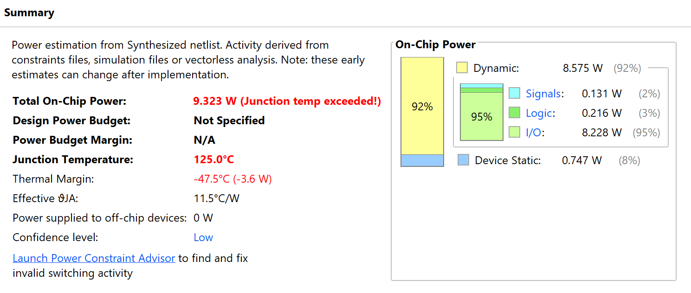

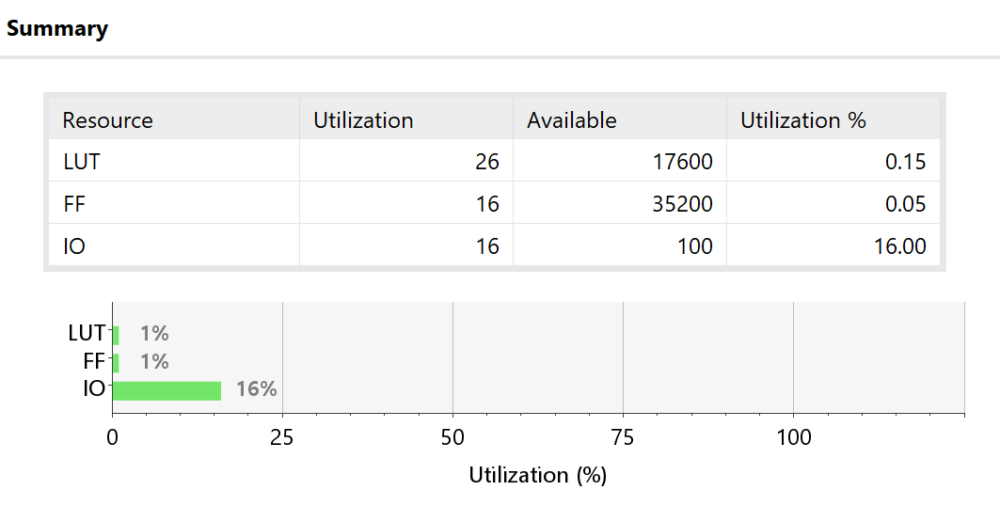

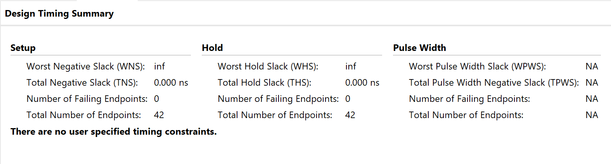

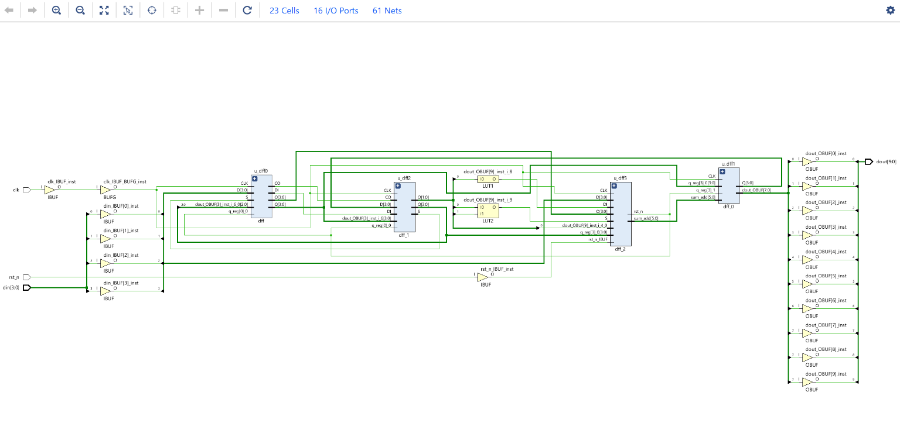

Test Bench Code

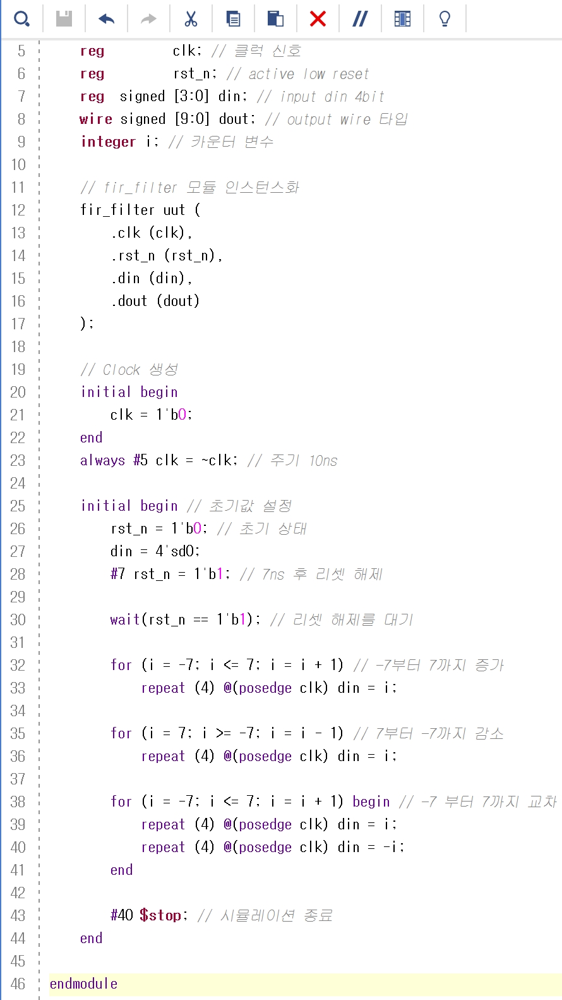

[testbench code]

작성된 테스트벤치는 다음과 같다.

먼저, 클록 신호는 10ns 주기로 토글되며 active-low 리셋 신호 사용, 시뮬레이션 초기에 7ns 동안 0으로 유지되며 이후 1로 복귀한다.  Din은 부호 있는 4비트 입력값으로, 필터에 제공되는 시퀀스 데이터를 나타낸다. Dout은 FIR  필터 출력으로 서브모듈 fir_filter와 연결된다. 마지막으로  i는 카운터 변수로 입력 패턴 생성에 사용한다.

그리고 FIR 필터 모듈(fir_filter)을 uut라는 이름으로 인스턴스화하고, 테스트벤치 내부의 신호들과 연결한다. 초기에는 rst_n을 0으로 설정하고 din도 0으로 초기화한 뒤, 7ns 후 리셋을 해제한다. 이후 wait문을 통해 리셋 해제를 확인하고 입력을 시작한다.

i = -7부터 7까지 1씩 증가 ,i = 7부터 -7까지 1씩 감소, i = -7부터 7까지 증가 이렇게 3가지 경우로 입력값을 +i, -i 순으로 번갈아 제공하여 필터의 대칭성과 반응을 검증한다.

Simulation Result

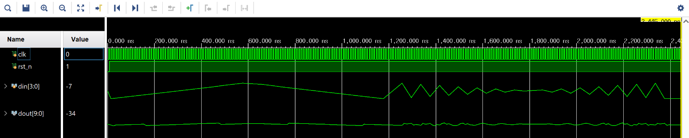

[behavioral simulation]

이 시뮬레이션 파형은 FIR 필터(fir_filter) 모듈에 대해 다양한 입력이 주어졌을 때 출력(dout)이 어떻게 반응하는지를 시간축 기준으로 관찰한 것이다. 테스트는 입력 din에 대해 세 가지 패턴(증가, 감소, 교차)이 주기적으로 주입되며, 각 입력 변화는 클럭 상승 엣지에서 적용된다.

먼저 clk는 일정한 주기(10ns)로 정상 동작하고 있으며 rst_n은 초기 짧은 구간에서 low(0)였다가 곧 high(1)로 복귀되어 회로가 정상 동작을 시작하는 것을 확인할 수 있다.

그리고 시뮬레이션 초기 구간에서는 din이 -7부터 +7까지 증가하며 선형적으로 상승하는 패턴을 보인다. 이후 다시 +7에서 -7로 감소하며 삼각파 형태의 입력이 주어진다. 마지막에는 -7~+7을 오가며 교차되는 대칭 신호가 입력된다.

특히 입력이 급격히 변하는 교차 구간에서는 출력도 진동하듯 변화하며 필터의 동작 특성이 잘 관찰되어 있다. 즉, 출력 파형은 전반적으로 노이즈 없이 연속적인 변화 양상을 보이며, 필터링 기능이 제대로 구현되었음을 확인할 수 있다.

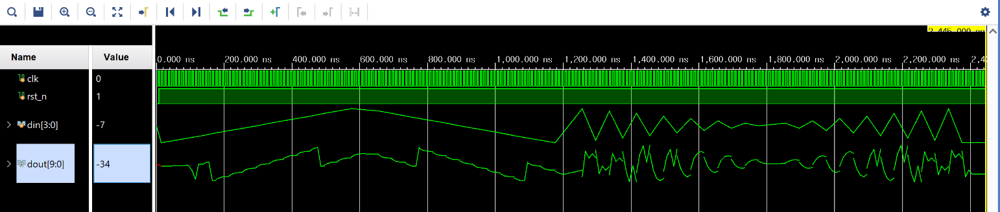

[post synthesis functional simulation]

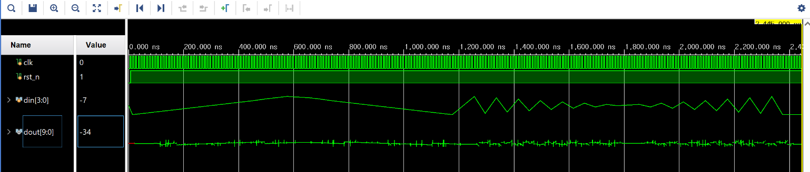

[post synthesis timing simulation]

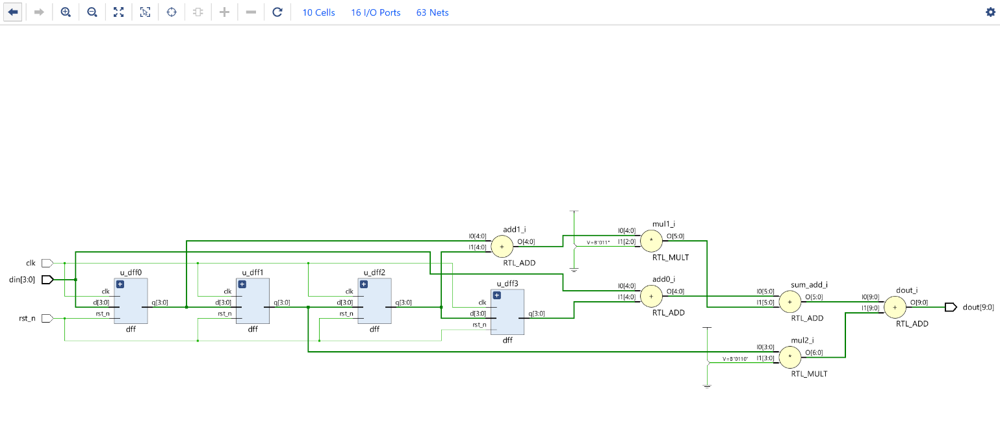

[elaborated]

고찰

이번 FIR 필터 설계를 통해 입력 신호를 지연시키고, 각 지연된 값에 계수를 곱해 합산함으로써 신호를 필터링하는 구조를 이해할 수 있었다. 시뮬레이션 결과에서도 출력이 입력의 급격한 변화에 대해 완만하게 반응하는 것을 확인하였고, 이는 FIR 필터의 low pass filter 특성이 잘 반영된 결과였다. 특히 부호 처리, 클록 동기화, 리셋 동작 등 기본적인 디지털 설계 요소들이 올바르게 적용되어 실용적인 필터 회로를 구현할 수 있었던 점이 인상 깊었다.

# 3번 문제

Block diagram

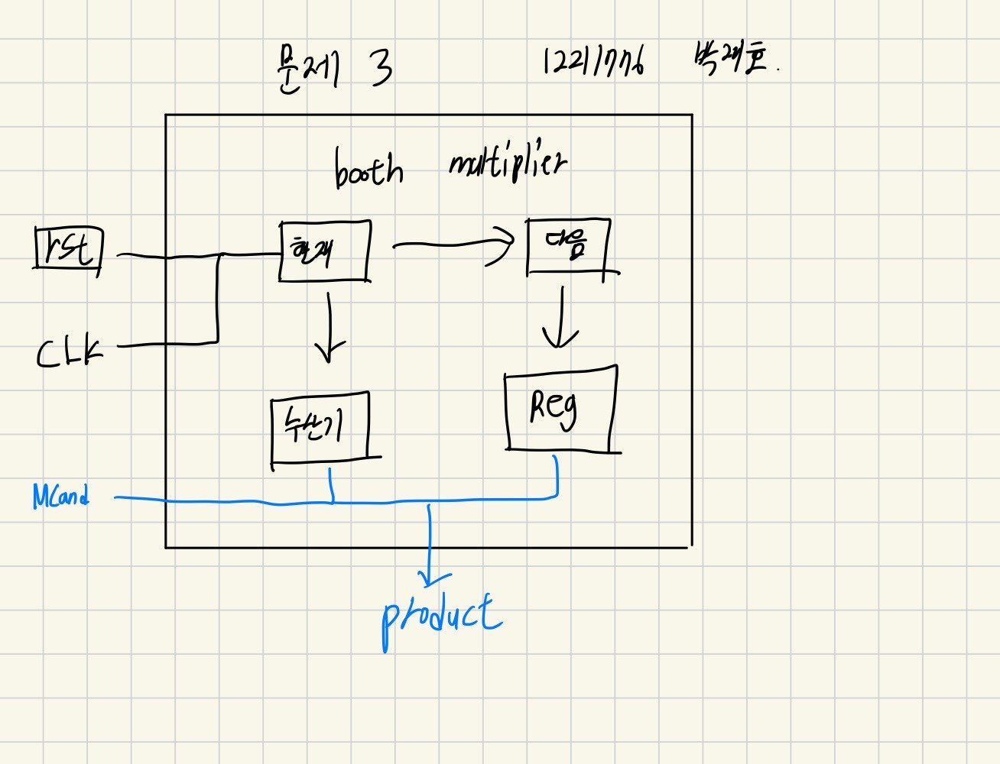

[작성한 블록 다이어그램]

Verilog  Code /  주석

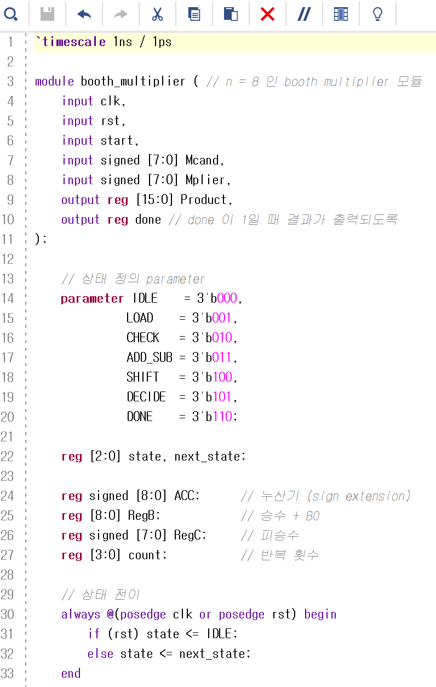

[module 앞부분]

이 모듈은 부호 있는 8비트 곱셈을 수행하는 Booth 알고리즘 기반의 곱셈기로, 클럭 동기식 상태기계를 기반으로 동작한다. start 신호를 통해 곱셈 연산을 시작하며, 완료되면 done 신호가 high가 되고 최종 결과는 Product에 출력된다.

포트는 다음과 같다.

clk: 클럭 입력,  rst: 동기 리셋 신호, start: 곱셈 시작 신호, Mcand: 피승수(8비트, signed),  Mplier: 승수(8비트, signed), Product: 곱셈 결과(16비트, signed),  done: 연산 완료 플래그

그리고 7개의 상태가 정의되어 있으며, 각각의 기능은 다음과 같다

1. IDLE: 초기 상태 또는 대기 상태

1. LOAD: 내부 레지스터 초기화 및 데이터 로딩

1. CHECK: Booth 알고리즘에서 현재 비트 조합 검사

1. ADD_SUB: 조건에 따라 덧셈 또는 뺄셈 수행

1. SHIFT: 누산기 및 레지스터 시프트 연산

1. DECIDE: 반복 횟수 판단 및 다음 상태 결정

1. DONE: 연산 완료 상태, done 신호 활성화

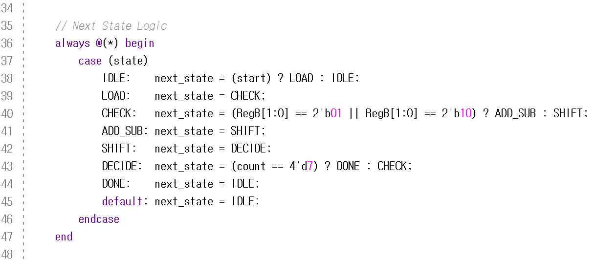

[module 중간부분]

그리고 다음상태를 나타내는 always @(*) 블록 내의 case 문을 통해 상태별 조건을 명시하였으며, Booth 알고리즘의 연산 절차에 따라 상태가 순차적으로 진행되도록 구성하였다.

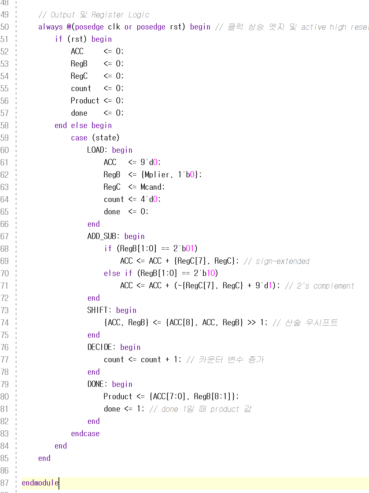

[module 끝부분]

이 블록은 상태값에 따라 내부 레지스터(ACC, RegB, RegC, count)를 업데이트하고 최종 결과(Product)와 완료 신호(done)를 설정하는 핵심 처리부이다. Booth 알고리즘의 각 단계를 클록 상승 에지에서 순차적으로 수행하며, 동작 흐름은 상태 머신의 state 값에 따라 달라진다.

각 과정은 다음과 같다.

LOAD

1. 누산기 ACC를 0으로 초기화

1. RegB는 승수 Mplier에 보조 비트 0을 추가한 9비트로 저장

1. RegC에는 피승수 Mcand를 저장

1. 카운터 count 초기화, done 비활성화

ADD_SUB

1. Booth 조건에 따라 덧셈 또는 뺄셈 연산 수행

1. RegB[1:0]이 01이면 RegC를 ACC에 더함

1. RegB[1:0]이 10이면 RegC의 2의 보수 값을 ACC에 더함

1. sign-extension을 위해 RegC[7]이 부호비트로 추가됨

SHIFT

1. ACC와 RegB를 하나의 18비트로 묶고, 산술 우시프트 연산 수행

1. 결과를 다시 ACC와 RegB로 분할 저장

DECIDE

1. count 값을 1 증가시킴

1. 이후 상태 전이 로직에서 8회 수행 완료 여부를 판단

DONE

1. 최종 결과인 Product는 ACC의 하위 8비트와 RegB의 상위 8비트를 이어붙여 생성됨

1. done 신호를 1로 설정하여 연산 종료를 표시함

Synthesis Report

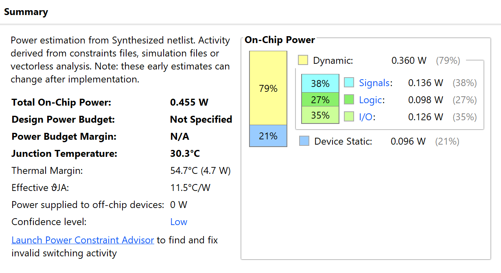

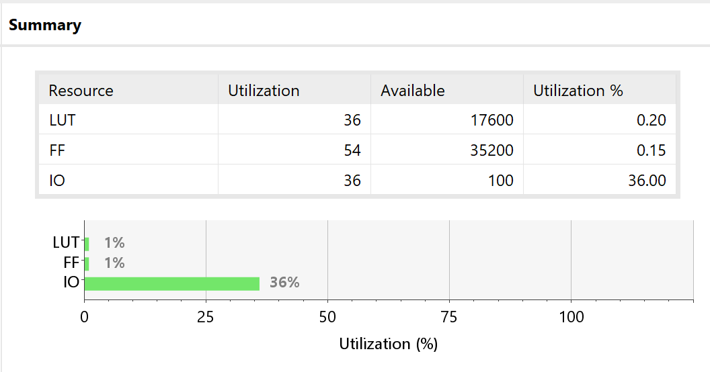

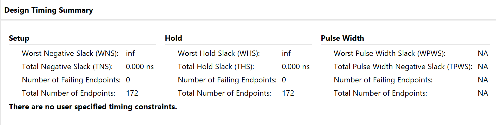

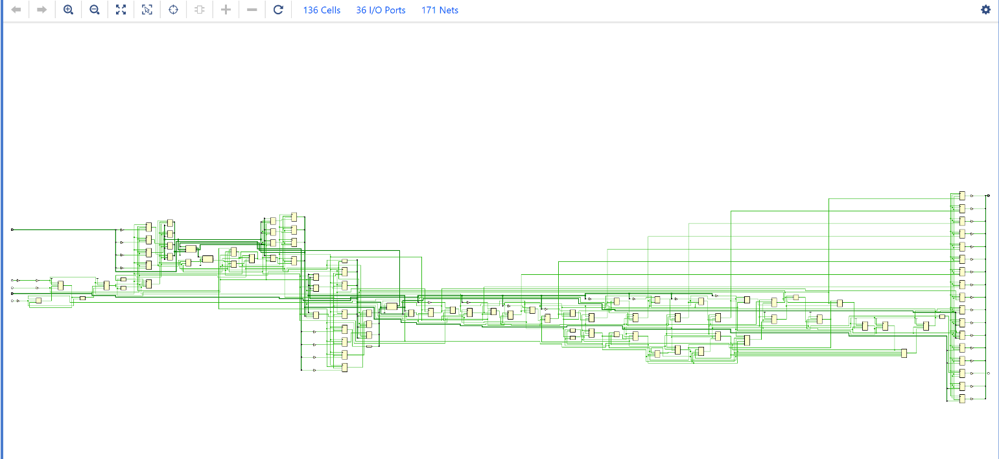

Test Bench Code

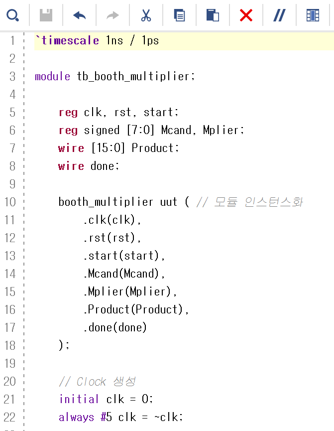

[testbench code]

먼저 input과 output 을 연결하고 테스트벤치 내에서 설계 대상인 booth_multiplier를 uut라는 이름으로 인스턴스화하여, 내부에서 선언한 신호들과 연결한다.

초기에는 clk = 0으로 설정되며, always #5 clk = ~clk; 문을 통해 10ns 주기의 클럭 파형을 자동 생성한다. 이는 모든 동작이 클럭 상승 엣지를 기준으로 수행되도록 한다.

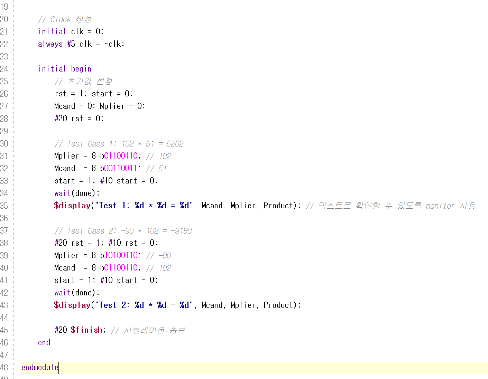

[testbench code]

그리고 각 테스트 케이스에 대해서 기술하고, display를 이용하여 텍스트로 결과를 확인할 수 있도록 하였다. 각 테스트 케이스의 연산 과정은 다음과 같다.

테스트 케이스 1 — 양수 곱셈

1. 입력: Mplier = 102, Mcand = 51

1. 예상 출력: 5202 (102 × 51)

1. 연산 과정

  - 입력 설정 후 start = 1

  - 10ns 후 start = 0으로 비활성화

  - wait(done)으로 연산 종료 대기

  - 결과는 $display로 출력됨 → Test 1: 102 * 51 = 5202

테스트 케이스 2 — 음수 × 양수

1. 입력: Mplier = -90, Mcand = 102

1. 예상 출력: -9180 (-90 × 102)

1. 연산 과정

  - 리셋 신호 재활성화 (rst = 1) 후 다시 해제

  - 입력값 설정 및 start 신호 트리거

  - 연산 완료 대기 후 결과 출력

  - 결과는 $display로 출력됨 → Test 2: -90 * 102 = -9180

Simulation Result

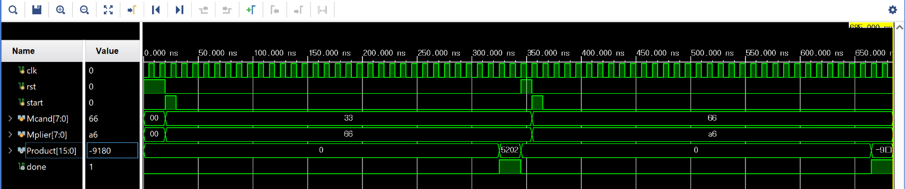

[behavioral simulation]

이 시뮬레이션 파형은 booth_multiplier 모듈의 기능을 두 개의 테스트 케이스를 통해 검증한 결과를 보여준다. 클록, 입력값(Mcand, Mplier), 출력값(Product), 완료 신호(done)의 시간축 변화를 기반으로 연산의 정확성과 타이밍을 분석하였다.

먼저, 약 330ns 에서 done의 값이 1일 때, 5202의 값을 갖는 것을 확인할 수 있다. 다음으로 약 500ns 일 때 done이 1이 되고, -9180의 값을 가지는 것을 확인하였다. 이를 통해 두 연산 모두 정확한 출력값을 생성하였으며, 결과는 Booth 알고리즘의 정수 곱셈 결과와 일치함을 증명하였다.

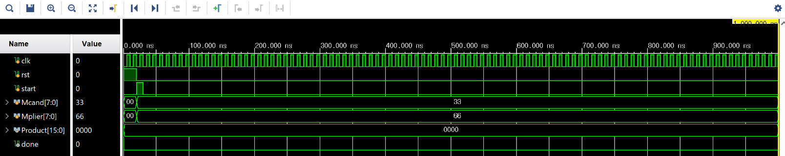

[post synthesis functional simulation]

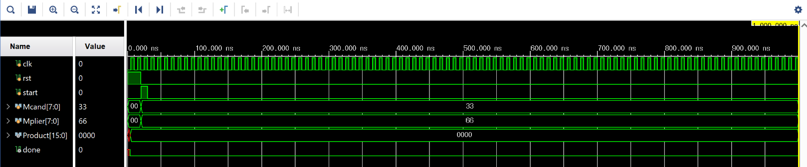

[post synthesis timing simulation]

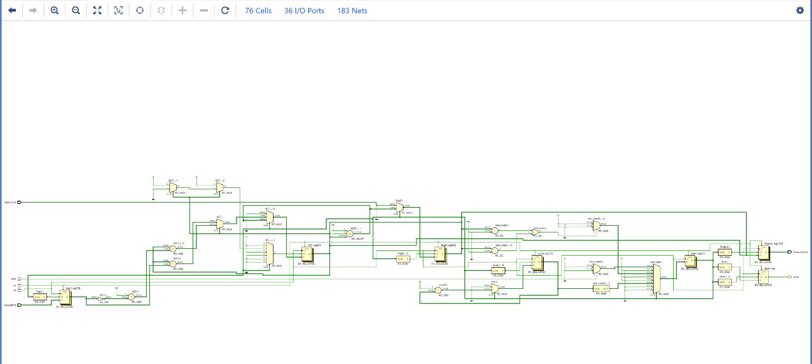

[elaborated design]

고찰

Booth 곱셈기 설계를 통해 상태기반 제어와 Booth 알고리즘의 적용 방식을 직접 구현해보며, 부호 있는 곱셈 연산의 구조와 절차를 명확히 이해할 수 있었다. 시뮬레이션 결과 두 테스트 모두 정확한 곱셈 결과를 출력하였고, FSM 흐름과 데이터 경로가 정상적으로 동작함을 확인하였다. 특히 음수 연산 처리와 산술 시프트, 조건 분기에 대한 설계 경험이 유익했으며, 실제 하드웨어 설계 시 부호 확장과 레지스터 제어의 중요성을 체감할 수 있었다.

| Discussion |
| --- |
| . - Verilog Coding을 시작하기 전 작성한 Block Diagram - 작성한 Verilog Module에 대한 설명 - 작성한 Code가 어떤 동작을 하는지? 왜 그런 동작을 하는지? - 작성한 Test Bench Code가 어떤 동작을 하는지? - Simulation 파형이 왜 그렇게 나온것인지? - 작성한 Code가 잘 동작하지 않는다면 어디서 문제가 발생한 것인지? - 오류를 해결했다면, 어떤 부분에서 해결을 했고, 왜 오류가 발생하였는지? |
